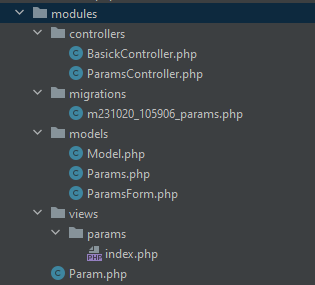
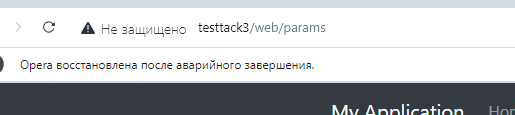

Модуль находится по следующему пути \modules

Для работы модуля необходимо внести/проверить в web.php на наличие данных записей

Переход на страничку осуществляется по url приведенному ниже

или вставить раздел в меню файла views\layouts\main.php (в данном проекте это уже сделано)

Необходимо создать базу данных с кадеровкой utf8_general_ci, конфиг с подключение в файле 
config/db.php

Создание миграции в модуля осуществляется слудующим вызовом, по анологии и остальные команды 

